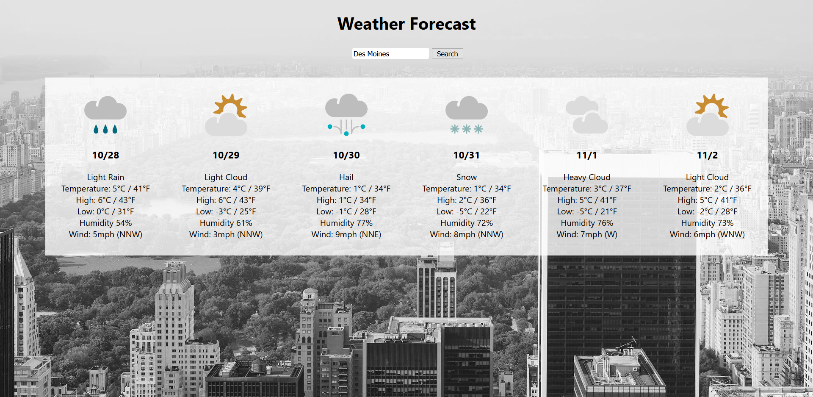

# Weather Forecast App

[Live](https://metaweatherapi.herokuapp.com/)

Look at weather forecast in major cities around the world using [metaweather api](https://www.metaweather.com/api/).

## How To Use

1. Enter the name of a city or a geographic coordinate
2. If available, the weather for the next 6 days will be displayed

## Features

- Data validation before the API request
- Proxy is used to circumvent the CORS Access-Control Allow Origin Error
- Weather data is easy to read

## UI/UX

